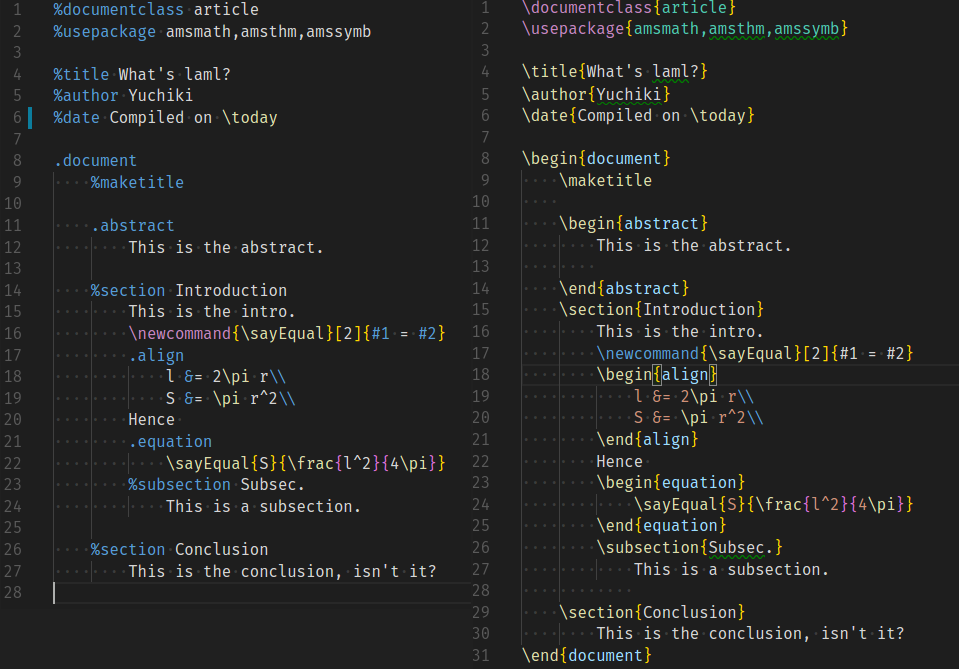
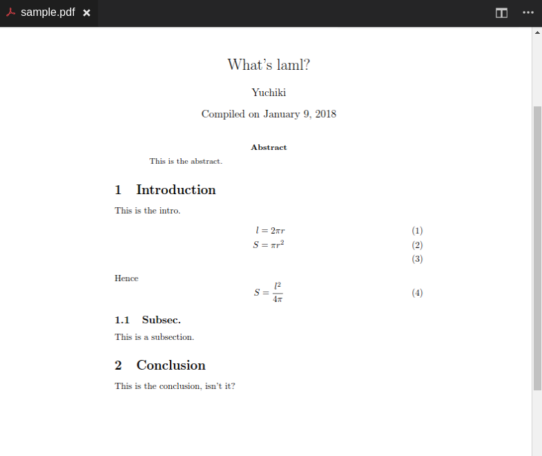

# laml-highlighter README

A syntax highliter for laml, a haml-like light weight notion for LaTeX.





## How to install the [Laml Converter](https://github.com/yuchiki/laml)?

```sh
git clone git@github.com:yuchiki/laml.git
cd laml
make install
```

## Release Notes
